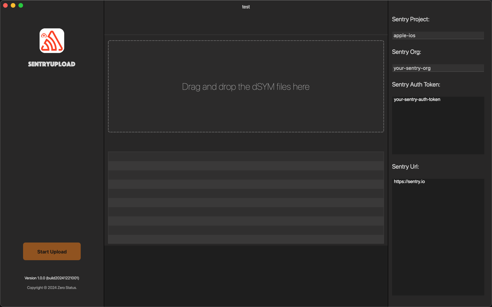

  

# SentryUpload 🚀

A Simple and User-Friendly Sentry Debug File Upload Tool

## Key Features ✨

- Drag and drop Debug files directly to Sentry
- Clean and intuitive user interface
- Real-time upload progress tracking
- Support for multiple file uploads simultaneously
- Instant upload status feedback
- Secure file transfer with error handling
- Lightweight and efficient performance

## How to Use 📝

1. Launch the SentryUpload application
2. Drag and drop your Debug files into the upload zone
3. Monitor the upload progress in real-time
4. Review the upload results instantly

## Supported File Types 📁

- dSYM files (Debug Symbol Files)
