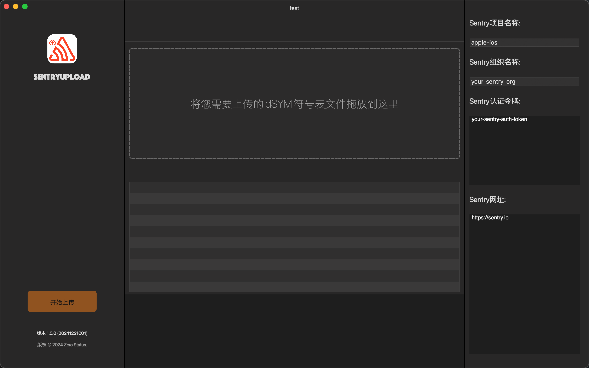

  

# SentryUpload 🚀

一个简单易用的 Sentry 调试文件上传工具

## 主要特性 ✨

- 直接拖放调试文件到 Sentry
- 清晰直观的用户界面
- 实时上传进度跟踪
- 支持同时上传多个文件
- 即时上传状态反馈
- 安全的文件传输与错误处理
- 轻量高效的性能

## 使用方法 📝

1. 启动 SentryUpload 应用程序
2. 将调试文件拖放到上传区域
3. 实时监控上传进度
4. 立即查看上传结果

## 支持的文件类型 📁

- dSYM 文件（调试符号文件）

## 作者的其他应用 🧑‍💻

### LocaleStudio

一款功能强大的 iOS 开发者本地化工具。旨在简化 iOS 和 Mac 应用程序开发人员的本地化流程。

### CSV-JSON

一个简单但功能强大的 CSV 和 JSON 格式转换工具。

